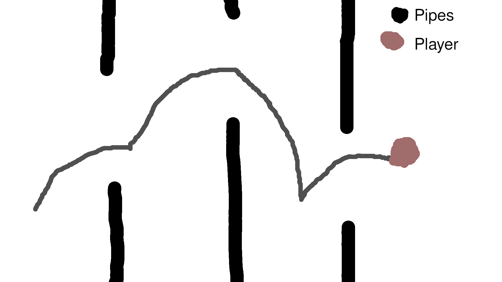
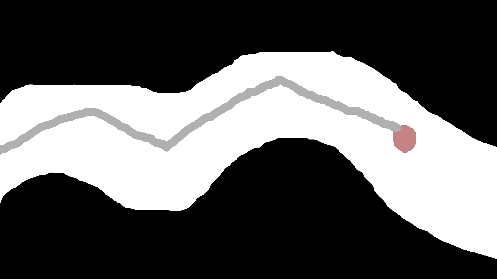
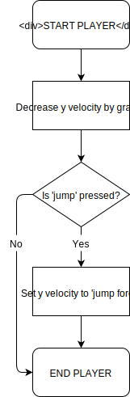
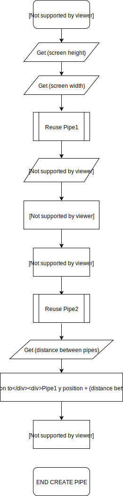

# Flying Guy
As our first game, we decided to start with a simple game to get familiar with our engine.  The first game that we agreed to create was a game that you travelled to the right whilst dodging obstacles.  The game was directly inspired by the mobile game [Flappy Bird](https://en.wikipedia.org/wiki/Flappy_Bird). 
## Gameplay
In 'Flying Guy' you have to navigate yourself around pipes which end the game when you touch them.  The further that you go, the higher your score will be.

To differentiate the game from being a direct clone of Flappy Bird, we decided to add a second gamemode.  The first gamemode will just be normal Flappy Bird, where you press a button to jump.

The second gamemode is partially inspired by a simillar mode in the game [Geometry Dash](https://store.steampowered.com/app/322170/Geometry_Dash/) where you hold down jump to go up at a constant speed, and let go to go down at the same speed ([example](https://youtu.be/PQkAjNPKxDM?t=15)).  


## Planning
Before creating the game, we created a list of criteria that this game had to meet.  These were as following:
- The gameplay is dynamic
- The game does not suffer from slowdown/lag
- The game is bug free

A simple structure for the game was also created.
### Main loop
```pascal
START MAIN
TIME = 0
SPEED = 20
PIPES = []
SCREEN_RIGHT = 400
SCREEN_BOTTOM = 200

WHILE PLAYER.IS_ALIVE
  TIME += 1
  FOR EACH IN PIPES AS P
    IF P.COLLIDES(PLAYER)
      KILL_PLAYER()

  FOR EACH IN PIPES AS P
    P.MOVE_BY(SPEED)
    IF P.POSITION.X < 0
      P.FREE()
  
  IF TIME == 10
    CREATE NEW_PIPE
    NEW_PIPE.POSITION = 
                (SCREEN_RIGHT,
                 RANDOM(0, SCREEN_BOTTOM))
    PIPES.ADD(NEW_PIPE)
    TIME = 0

END MAIN
``` 


    mermaid graph TD
      A(START MAIN) --> B[Player Movement]
      B-->C[Increment 'time' variable]
      C-->D[Increment 'speed' variable]
      D-->E[Move pipes left by speed * delta]
      E-->F[Handle collision]
      F-->G{is 'time' equal to<br> 'time between pipes'}
      G-->|No|B
      G--> |Yes| H[Create new pipe]
      H-->B

### Player
```
(Player class)
set position to 0
set gravity to 9.8
set velocity to Vector(0, 0)

while the player is alive: 
  subtract gravity from the vertical velocity
  if Space is pressed and touching the ground, set the vertical velocity to 10
  Add the velocity to the current position

```

### Collision
insert things
### Create Pipe


### Time Management
Because the game was meant to be an exercise for using the engine, the time that it takes to create the game should be very short.  It should take use a week at most to complete the game.

