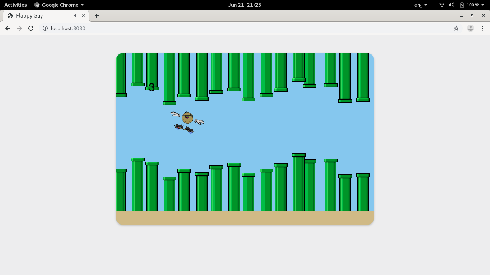
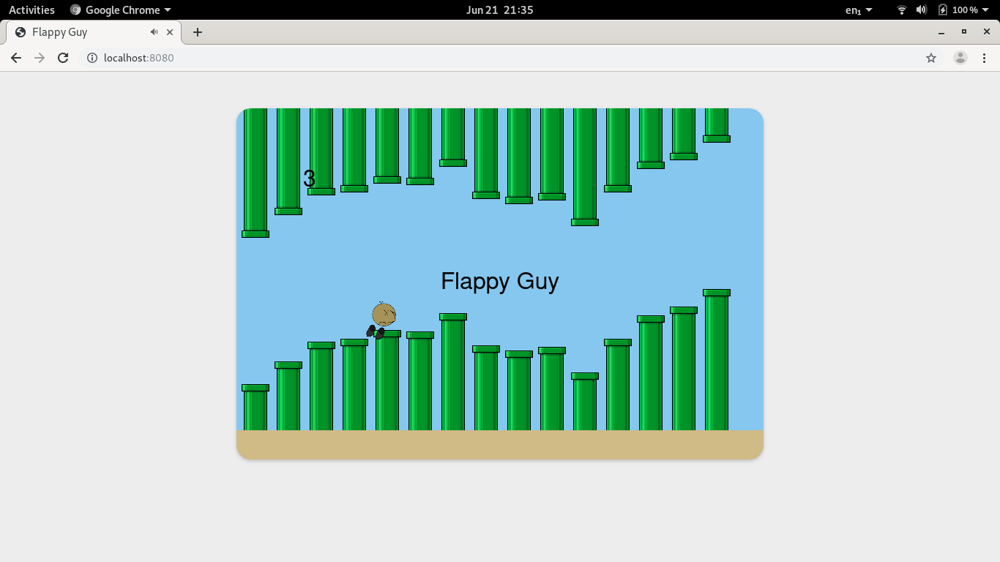

# Flying Guy Day 6
Today I made numerous changes to the game.  I changed how the second gamemode controlled, added a death animation,  improved the pipe spawning logic, and fixed bugs that were not previously caught.
## Second game mode change
When we got other people to playtest our game, one of their suggestions was to give the player some momentum during the second gamemode.  After discussing as a group, we decided to listen to our playtesters and change the second gamemode.

Previously in the second gamemode, you would press jump to go up at a constant speed and let go to go down at a constant speed.

**Previous second gamemode diagram**

Our change was that instead of moving the player at a constant speed, we would instead increase the velocity of the player instead.  When you held down jump, you would accelerate upwards; and when you let go of jump, you would accelerate downwards.

When we tested this with our playtesters, they felt that the player felt off.  With this feedback, we experimented for potential solutions.

The solution that we ended with was to increase slowdown speed.  If the player was going down and held jump, the rate at which your velocity would increase was multiplied by 1.5, and vice versa.  This meant that you could stop faster and avoid collising with the pipes more easily.  When testing again with the playtesters, they were satisfied with the results.

## Death Animation
The unused death sprite was finally implimented along with a death animation.  Previously when you died, you would stop moving without any indication that you died; now when you died you would spin off the screen.

## Improved pipe spawning.  
An issue with the previous method of spawining pipes were that the distance between pipes would be off during high speeds or when the framerate was low.  This wasn't an issue during the first gamemode as the pipes were far apart; but during the second gamemode, where the pipes were very close together, it was very noticable.

**Uneven pipe distances**


To fix this, when we spawned a new pipe in, we subtracted from the x position of the new pipes the distance since the last pipe, minus the distanc between pipes.  Or in code form:
```typescript
pipe.position.x = screenWidth - (distanceSinceLastPipe - distanceBetweenPipes);
```
This resulted in an even distance between the pipes and gave a more polished look.

**Even pipe distances**


## Bug Fixes
I took some time to clean the game's code a bit, organising and looking out for some bugs, which there were a few.  There were some bits of spaghetti code and I removed the ones that could easily be resolved.  

