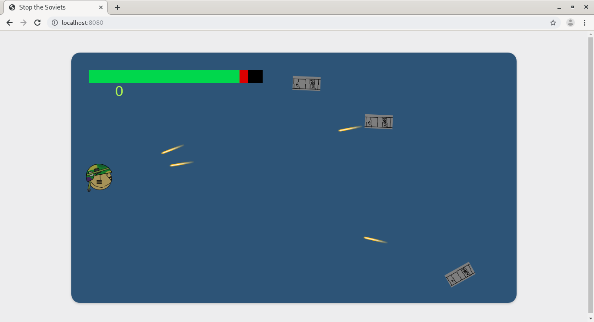

# Day 4: Visual enhancements
#### Author: Joon Suh

Today I improved the visual elements of the game.  I added Finley's new player sprite into the game and added a health bar.

The healthbar is made of 3 different rects; the black base that is static; the green bar that represents player health; and teh red bar that defills when the player gets hit, indicating that you got hit.  
