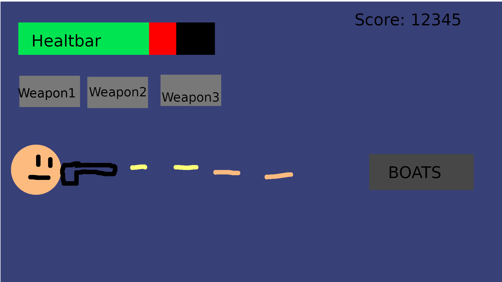
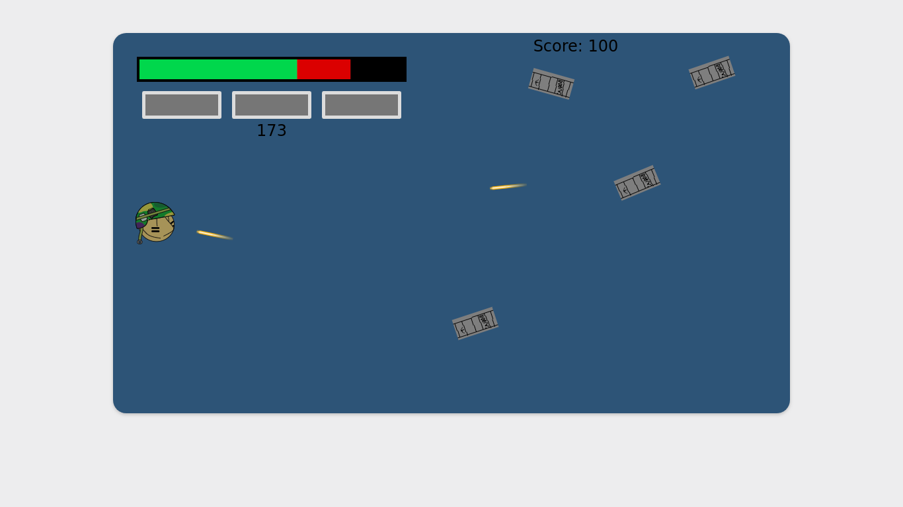
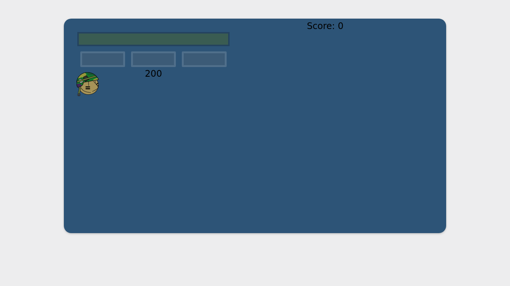

# Day 6: UI Improvements
#### Author: Joon Suh
Today I improved the UI to the game.  I remodelled the UI to resemble the storyboard, but with more polish.

Using this image as a base, I created a functional UI with a working healthbar and score counter.  In addition, I added some visual cues for the weapon being used that was not present on the storyboard.  

__New UI__

Compared to the previous UI, there is now a weapon selection (without any icons currently) and a score counter on the top right.  The UI also fades if you go under so the UI does not obstruct with your dodging.  

UI Fading

