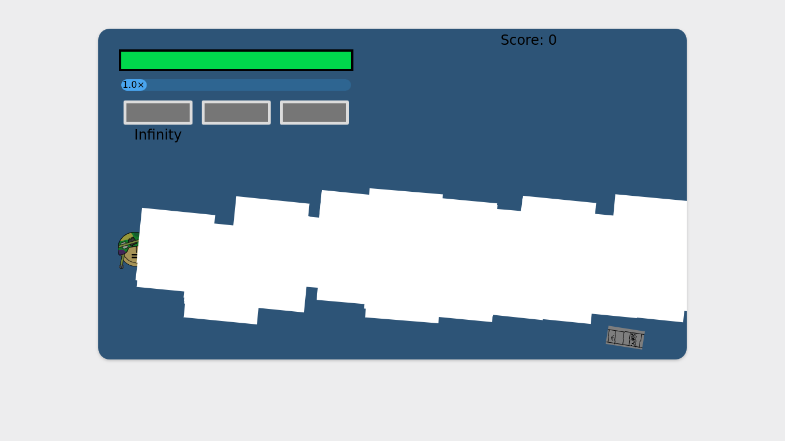
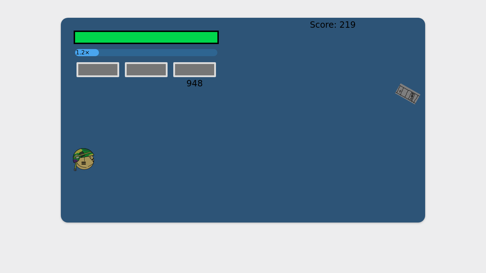

# Day 7: Gameplay Update
**Author: Joon Suh**  
**Date: 2019 07 26**

## Overview
I made a lot of new additions to the game today, most being gameplay.  I redesigned the weapons that the player can use and designed them to be balanced and not too strong or too weak.  I also added a new gameplay mechanic called 'Blitz'.  I also added a wave system for the boat spawning so the boats don't just come in a constant stream.

## Redesigned Weapons
I completely redesigned the player weapons from scratch.  One of the most important changes made was to the bullets.  If a bullet kills a boat, instead of deleting the bullet, it instead reduces the damage left on the bullet by how much damage it did to the boat.  For example, if a bullet does 50 damage and hits a boat with 40 health remaining, the bullet would destroy the boat and would have 10 damage remaining.  This meant that the bullets can now pierce which changes how the weapons have to be desinged.

The 3 player weapons had each of their own advantages and disadvantages.  

The primary weapon was the all-round balanced shot type, but also had the advantage of having infinite ammunition.  

The secondary weapon was the high DPS shot type.  It chewed through boats but had very limited ammunition.

The tertiary weapon was a unique charge shot, where the longer you held the shoot button, the more damage it would do on release.  It had the lowest DPS of all of the weapons but acceled at burst damage.  It also had limited ammunition but is not as much of an issue as the secondary weapon.

## Blitz Mechanic
In the game's previous state, there was not much variance in scoring; boats gave the player a fixed amount of points no matter what.  This resulted in the game not rewarding skillful play.  To fix this, I introduced the 'Blitz' mechanic.

The 'Blitz' mechanic was  a score multiplier mechanic which would reward more points the better you did.  When you destroyed boats, the Blitz value went up, when you let a boat get through, the Blitz value went down.  This mechanic actively punished letting boats go through and promoted agressive play.  

However, I was not fully satisfied with this as it wasn't all to interesing.  So, I added an extention to the 'Blitz' mechanic.  When your score multiplier was greater or equal to 2.0x, you could use 1.0 of the multiplier to unleash a powerful attack.  I called this attack the 'Blitz', after the title of the game.  This mechanic gave less skilled players an opportunity to save themselves from taking damage, but at the cost of your score multiplier.  This made skilled players stand out more as the less skilled would spend most of the time with lower score multipliers; but also provided those less skilled players a more enjoyable and casual experience.  

__Blitz Attack__ (with placeholder assets)

## UI Extention
With the new 'Blitz' mechanic, I also added a 'Blitz Meter' to display how much your score multiplier was. 

__Blitz Meter in UI__

