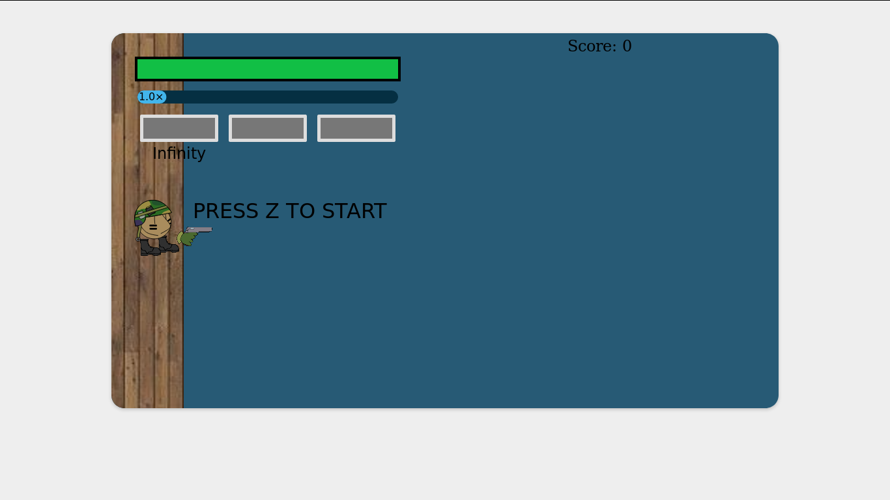

# Day 10: Keyboard Ghosting + additional sprites
**Author: Joon Suh**  
**Date: 2019 08 08**

## Keyboard Ghosting
While playtesting the game, we noticed some keyboard ghosting issues that prevented certain keyboard combinations.  This caused unwarranted deaths to the player and resulted in a worse experience.

To fix this issue we added an alternate control layout using I, J, K, and L as the arrow keys.  We chose these keys as they were arranged in a T-like shape and did not appear to cause keyboard ghosting.

## Additional Sprites
We also decided to add some extra visuals to the game.  We added text telling the user how to start the game.  Previously, there was no indication on how to start the game, adding this helps the user.

We also added a deck for the player to stand on.  Previously, the player stood on water and the boats would disapper randomly after a point.  Now the boats disapper when they touch the deck.
**New Visuals**

